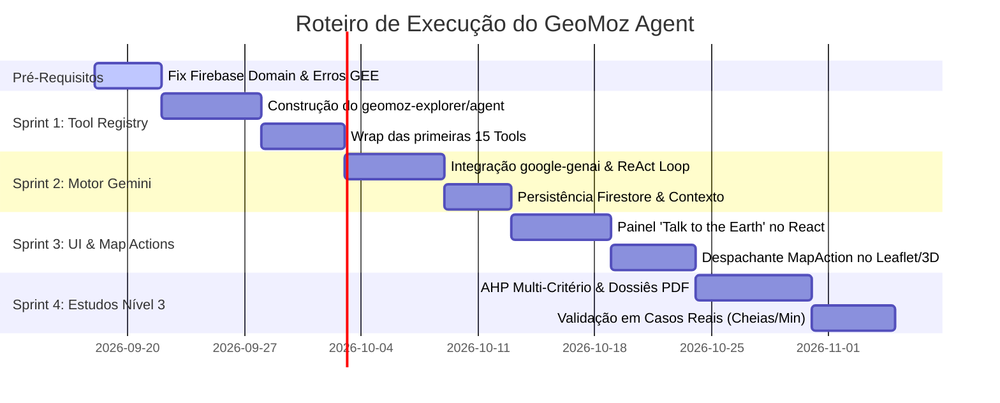

# GeoMoz Agent — Master Roadmap & Arquitetura Técnica Completa

> **Documento Estratégico & Operacional**  
> **Versão:** 2.2.0-alpha (Agentic GIS)  
> **Data:** Setembro de 2026  
> **Equipa:** Geolithica / GeoMoz Explorer  

---

## 📌 Índice
1. [Diagnóstico & Resolução de Pré-Requisitos Críticos](#1-diagnóstico--resolução-de-pré-requisitos-críticos)
   - [1.1 Firebase: Error (auth/unauthorized-domain)](#11-firebase-error-authunauthorized-domain)
   - [1.2 Delimitação de Bacias D8 (`compute_watershed_from_point`)](#12-delimitação-de-bacias-d8-compute_watershed_from_point)
   - [1.3 Rede Hidrográfica de Strahler (`compute_river_network`)](#13-rede-hidrográfica-de-strahler-compute_river_network)
   - [1.4 Lineamentos Estruturais Canny/Sobel (`compute_lineaments_tile`)](#14-lineamentos-estruturais-cannysobel-compute_lineaments_tile)
   - [1.5 Análise Multi-Critério / Mineral Targeting (`_build_targeting_score`, `compute_targeting_tile`)](#15-análise-multi-critério--mineral-targeting-_build_targeting_score-compute_targeting_tile)
2. [Visão Central do GeoMoz Agent (Talk to the Earth)](#2-visão-central-do-geomoz-agent-talk-to-the-earth)
3. [GeoMoz Tool Registry (Especificação Completa das 35 Ferramentas)](#3-geomoz-tool-registry-especificação-completa-das-35-ferramentas)
4. [O Cérebro do Agente: Gemini Geo-Planner & ReAct Loop](#4-o-cérebro-do-agente-gemini-geo-planner--react-loop)
5. [State-Awareness: Comunicação Bidirecional Agente ⇄ Mapa](#5-state-awareness-comunicação-bidirecional-agente--mapa)
6. [Segurança, Governação & BYO-GEE](#6-segurança-governação--byo-gee)
7. [Plano de Implementação Faseado (Sprints 1 a 4)](#7-plano-de-implementação-faseado-sprints-1-a-4)

---

## 1. Diagnóstico & Resolução de Pré-Requisitos Críticos

Antes de orquestrar o agente autónomo, é obrigatório garantir que os motores fundamentais de dados e infraestrutura operam sem falhas ou exceções silenciosas.

### 1.1 Firebase: Error (`auth/unauthorized-domain`)
* **Sintoma:** O utilizador tenta iniciar sessão com Google ou e-mail/senha e recebe a mensagem `Firebase: Error (auth/unauthorized-domain)`.
* **Causa Raiz:** O Firebase Authentication possui uma lista de proteção rigorosa (*Authorized Domains*). Quando a aplicação é testada em `localhost`, num IP de rede local, num domínio de Cloud Run ou num ambiente novo de teste, o Firebase recusa o handshake OAuth se a origem não estiver explicitamente autorizada.
* **Plano de Resolução:**
  1. **Ação na Consola do Firebase:**
     * Aceder a: **Firebase Console** ➔ Projeto `geoprocessamento-426809` ➔ **Authentication** ➔ Separador **Settings** ➔ **Authorized domains**.
     * Adicionar os domínios:
       - `localhost`
       - `127.0.0.1`
       - `geoprocessamento-426809.web.app` (já configurado)
       - `geoprocessamento-426809.firebaseapp.com` (já configurado)
       - O domínio completo do serviço Cloud Run (`*.a.run.app`) e domínios de desenvolvimento locais/remotos.
  2. **Tratamento Resiliente no Frontend (`artifacts/geomoz-react/src/hooks/useAuth.tsx`):**
     * Adicionar o caso específico no formatador de erros:
       ```typescript
       case "auth/unauthorized-domain":
         return "Este domínio não está autorizado na consola do Firebase. Adicione este endereço em Firebase Console > Authentication > Settings > Authorized Domains.";
       ```
     * Permitir modo de visualização visitante/convidado em desenvolvimento caso o auth falhe temporariamente.

---

### 1.2 Delimitação de Bacias D8 (`compute_watershed_from_point`)
* **Localização:** `geomoz-explorer/gee_module.py` (linhas 2655–2780)
* **Sintoma:** Quando o utilizador clica num ponto afastado de um rio principal, o backend falha com `RuntimeError: "Nenhum canal de drenagem encontrado perto do ponto"`, ou a computação no GEE excede o tempo limite de 60 segundos (*Computation timed out*) durante as 60 iterações do D8.
* **Causa Raiz:**
  1. O algoritmo D8 puro no GEE executa `translate()` iterativamente 60 vezes sobre 8 direções de fluxo (`WWF/HydroSHEDS/15DIR`), acumulando uma árvore de operações pesadíssima.
  2. O snap de drenagem (`acc.gte(500)`) com `reduceRegion` a 500m falha quando o buffer de busca (15 km) não intersecta células com acumulação suficiente ou quando a redução retorna `None`.
* **Plano de Otimização:**
  1. **Hierarquia de Duplo Fallback:**
     * **Nível 1 (Instantâneo):** Tentar primeiro a coleção `WWF/HydroATLAS/v1/Basins/level10` (e `level08`). Se intersectar o ponto, devolve o polígono pré-computado em < 1 segundo.
     * **Nível 2 (D8 Otimizado):** Se for necessário traçado à medida, reduzir `max_iter` de 60 para 35 por defeito, com escala adaptativa (escala 90m para bacias pequenas, 500m para bacias regionais).
  2. **Snap Dinâmico de Linha de Água:** Se `min_acc = 500` não encontrar canal, tentar automaticamente com `min_acc = 100`. Se ainda assim não encontrar, ancorar o ponto clicado diretamente sem abortar com exceção fatal.

---

### 1.3 Rede Hidrográfica de Strahler (`compute_river_network`)
* **Localização:** `geomoz-explorer/gee_module.py` (linhas 2619–2653)
* **Sintoma:** Carregamento lento dos tiles de drenagem ou linhas fragmentadas quando se faz zoom em áreas provinciais amplas.
* **Causa Raiz:** O cálculo de reclassificação `ee.Image(0).where(acc.gte(100), 1)...` sobre o raster de acumulação de 15 arc-segundos (`WWF/HydroSHEDS/15ACC`) é feito em tempo real para todo o bounding box sem cache de visualização.
* **Plano de Otimização:**
  1. Parametrizar a escala e o limiar mínimo de ordem de canal (`min_order: 1..5`).
  2. Quando o zoom do mapa for menor que 9, omitir as ordens 1 e 2 (cabeceiras menores) e renderizar apenas canais de ordem 3+ para garantir resposta sub-segundo.
  3. Adicionar cache LRU de tiles de drenagem gerados para o limite da província.

---

### 1.4 Lineamentos Estruturais Canny/Sobel (`compute_lineaments_tile`)
* **Localização:** `geomoz-explorer/gee_module.py` (linhas 1785–1858)
* **Sintoma:** O cálculo do diagrama de rosa dos ventos causa atraso de 8–15s porque executa `aggregate_array("dir").getInfo()` bloqueando a thread principal com amostragem de 4.000 pontos.
* **Causa Raiz:** O método `_build_lineament_layers` calcula 4 azimutes de hillshade (0°, 45°, 90°, 135°), executa o Canny Edge Detector em cada um, tira o gradiente Sobel atan2 e depois força o download dos vetores de direção para montar os 18 bins da rosa no Python.
* **Plano de Otimização:**
  1. **Separação Assíncrona:** Devolver imediatamente os URLs dos tiles (densidade focal + bordas Canny cyan) para o mapa exibir de imediato.
  2. **Histograma no Servidor GEE:** Calcular a contagem dos 18 bins diretamente no Earth Engine através de `ee.Reducer.frequencyHistogram()` em vez de descarregar 4.000 valores brutos via `.getInfo()`.
  3. **Proteção de Geometria:** Forçar `dem.clip(region.buffer(1000))` para evitar artefactos de borda no Canny.

---

### 1.5 Análise Multi-Critério / Mineral Targeting (`_build_targeting_score`, `compute_targeting_tile`)
* **Localização:** `geomoz-explorer/gee_module.py` (linhas 1866–2030)
* **Sintoma:** Ocasionalmente ocorre erro 500 quando um preset combina índices do Sentinel-2 com lineamentos e declive em províncias de grandes dimensões (ex: Zambézia ou Niassa).
* **Causa Raiz:** O cruzamento de múltiplos sensores com resoluções diferentes (S2 a 10m/20m, DEM a 30m, CHIRPS a 5km) gera um grafo de computação gigantesco no GEE se a escala de redução estatística (`reduceRegion`) não for fixada adequadamente.
* **Plano de Otimização:**
  1. Garantir que todas as bandas normalizadas tenham `.unmask(0)` antes da soma ponderada.
  2. Fixar a escala de amostragem de estatísticas (`reduceRegion`) em 100m–250m com `bestEffort=True` e `maxPixels=1e9`.
  3. Adicionar memoização das compilações de satélite intermediárias (S2 e L8) durante a mesma sessão de análise.

---

## 2. Visão Central do GeoMoz Agent (Talk to the Earth)

O GeoMoz Agent é um **Agente Geoespacial ReAct (Reason + Act)** estruturado em três princípios inquebráveis:
1. **O LLM nunca inventa código GIS arbitrário em runtime.** Ele formula um plano de análise e invoca ferramentas validadas do *Tool Registry*.
2. **O Agente conhece o estado atual do mapa.** A cada interação, ele sabe exatamente qual a AOI selecionada, que camadas estão visíveis, as datas ativas e o nível de zoom.
3. **Execução Híbrida Inteligente:** Processamento massivo de satélite corre no Google Earth Engine; análises vetoriais e tabulares correm em Python/GeoPandas no Cloud Run; resultados e projetos persistem no Cloud Firestore.

---

## 3. GeoMoz Tool Registry (Especificação das 35 Ferramentas)

Todas as ferramentas residem em `geomoz-explorer/agent/tools/` e são expostas ao Gemini através de esquemas tipados Pydantic.

```
geomoz-explorer/agent/
├── __init__.py
├── registry.py            # Registo central e despachante de ferramentas
├── planner.py             # Orquestrador Gemini (ReAct loop)
├── context.py             # Gestor do estado do mapa e histórico de sessão
└── tools/
    ├── __init__.py
    ├── spatial_aoi.py     # Resolução de limites e buffers
    ├── earth_engine.py    # Índices de satélite e relevo
    ├── hydrology.py       # Bacias, drenagem e cheias
    ├── structures.py      # Lineamentos e falhas
    ├── multicriteria.py   # Modelos AHP e favorabilidade
    └── export_report.py   # Dossiês e downloads
```

### Matriz do Catálogo de Ferramentas

| ID | Nome da Ferramenta | Motor | Descrição |
|---|---|---|---|
| **T01** | `resolve_aoi(name, type)` | Python / GeoPandas | Resolve e retorna os limites GeoJSON de qualquer província/distrito de Moçambique. |
| **T02** | `get_current_aoi()` | Context | Devolve a área de estudo atualmente ativa no mapa do utilizador. |
| **T03** | `buffer_geometry(geometry, meters)` | GeoPandas / Shapely | Gera um buffer métrico em torno de um vetor ou ponto (EPSG:32736). |
| **T04** | `intersect_layers(layer_a, layer_b)` | GeoPandas | Interseta zonas de risco com infraestruturas (estradas, escolas, aldeias). |
| **T05** | `get_geology_units(aoi, filter_str)` | GeoPandas | Consulta as unidades litológicas da carta geológica 1:1M de Moçambique. |
| **T06** | `calculate_index(index, aoi, dates)` | Google Earth Engine | Computa índices espectrais (NDVI, NDWI, MNDWI, NDBI, SAVI, EVI). |
| **T07** | `calculate_mineral_indices(aoi)` | Google Earth Engine | Gera índices de argilas, óxidos de ferro e gossan via Sentinel-2 / Landsat. |
| **T08** | `get_elevation_dem(aoi)` | Google Earth Engine | Gera tile de hipsometria a partir do Copernicus GLO-30 (30m). |
| **T09** | `calculate_slope(aoi, unit)` | Google Earth Engine | Calcula declividade topográfica em graus (0–90°) ou percentagem. |
| **T10** | `calculate_contours(aoi, interval)` | Google Earth Engine | Gera curvas de nível com equidistância configurável (10m, 20m, 50m, 100m). |
| **T11** | `compute_topographic_profile(coords)`| Google Earth Engine | Amostra elevação ao longo de uma polilinha A→B para perfil topográfico. |
| **T12** | `delineate_watershed(lat, lon)` | GEE (HydroATLAS / D8) | Delimita a bacia hidrográfica a partir do ponto de exutório clicado. |
| **T13** | `get_river_network(aoi, min_order)` | GEE (HydroSHEDS) | Gera rede hidrográfica com classificação de ordens de Strahler (1 a 5). |
| **T14** | `calculate_drainage_density(basin)` | GEE / GeoPandas | Calcula a densidade de drenagem ($km/km^2$) dentro de uma bacia. |
| **T15** | `get_flood_susceptibility(aoi)` | GEE Multi-Index | Combina MNDWI histórico, declive plano e acumulação de fluxo. |
| **T16** | `get_precipitation_chirps(aoi, date)`| GEE (CHIRPS) | Quantifica a precipitação acumulada e anomalias pluviométricas. |
| **T17** | `calculate_spi(aoi, year)` | GEE (CHIRPS Z-Score) | Calcula o índice de seca meteorológica SPI-12 e correlação com NDVI. |
| **T18** | `extract_lineaments(aoi)` | GEE (Canny / Sobel) | Extrai fraturas e lineamentos estruturais a partir do relevo sombreado. |
| **T19** | `get_structural_rose(aoi)` | GEE / Python | Devolve a distribuição estatística de orientações estruturais (18 bins). |
| **T20** | `run_mineral_targeting(mineral, aoi)`| GEE Multi-criteria | Aplica score ponderado (0–100) para ouro, cobre, pedras preciosas, etc. |
| **T21** | `normalize_raster(layer_id, bounds)` | GEE | Normaliza qualquer camada raster para a escala uniforme [0, 1]. |
| **T22** | `run_multicriteria_ahp(weights)` | GEE Raster Overlay | Executa combinação linear ponderada de múltiplos critérios normalizados. |
| **T23** | `threshold_raster(layer_id, op, val)`| GEE Binary Mask | Isola áreas que cumprem uma condição (ex: `NDVI < 0.2` ou `Declive < 5°`). |
| **T24** | `calculate_zonal_statistics(layer)` | GEE / GeoPandas | Calcula área em $km^2$, percentagem e valores médios por zona. |
| **T25** | `detect_temporal_change(l1, l2)` | GEE Difference | Identifica zonas de ganho, perda ou estabilidade entre duas datas. |
| **T26** | `run_kmeans_clustering(aoi, k)` | Python ML / Scikit | Agrupamento não-supervisionado de padrões de solo/rocha. |
| **T27** | `query_admin_overlap(raster_mask)` | GeoPandas | Identifica distritos, postos administrativos e povoações afetadas. |
| **T28** | `set_map_layer(layer_config)` | Frontend Action | Envia comando ao mapa para ligar, desligar ou estilizar uma camada. |
| **T29** | `zoom_to_feature(bbox)` | Frontend Action | Move a câmara do mapa para a área ou feição encontrada. |
| **T30** | `update_map_legend(legend_data)` | Frontend Action | Atualiza a legenda visual no ecrã para refletir a nova análise. |
| **T31** | `export_geotiff(layer_id)` | GEE Export | Gera link assíncrono para descarregar o GeoTIFF georreferenciado. |
| **T32** | `export_shapefile(vector_id)` | GeoPandas Export | Empacota e disponibiliza o download de Shapefile ESRI (.zip). |
| **T33** | `generate_study_dossier(study_id)` | Python / PDF | Compila relatório técnico em PDF com mapas, gráficos e pareceres. |
| **T34** | `save_to_project_workspace(data)` | Cloud Firestore | Grava a análise na coleção do projeto ativo do utilizador. |
| **T35** | `request_user_confirmation(prompt)` | Security Gateway | Pede confirmação ao utilizador antes de executar tarefas de custo elevado. |

---

## 4. O Cérebro do Agente: Gemini Geo-Planner & ReAct Loop

### 4.1 O Modelo Recomendado
* **Modelo Principal:** `gemini-2.0-flash` (ou `gemini-1.5-flash`)
  * Latência inferior a 1,5s por turno.
  * Suporte nativo a *Parallel Function Calling* e *Streaming Thinking*.
  * Quota gratuita generosa no Google AI Studio (15 RPM) e integração com Cloud Secret Manager.

### 4.2 O Prompt de Sistema Especializado
```text
És o GeoMoz Agent, a Inteligência Geoespacial da Geolithica especializada na geologia, 
hidrologia e território de Moçambique.

O teu objetivo é resolver os pedidos do utilizador montando planos determinísticos de análise espacial.
NUNCA geres código imaginário ou números sem suporte empírico. 
Usa SEMPRE as ferramentas do Tool Registry para calcular os dados.

Regras Fundamentais:
1. Conhece o estado atual do mapa (AOI selecionada, camadas visíveis, período de datas).
2. Decompõe pedidos complexos num plano de passos ordenados (ReAct: Thought -> Action -> Observation).
3. Após receber os resultados das ferramentas, emite as 'map_actions' para atualizar o mapa interativo.
4. Explica sempre a base científica dos resultados (sensores utilizados, metodologia, limitações).
5. Ações destrutivas ou de exportação em massa exigem a ferramenta 'request_user_confirmation'.
```

### 4.3 O Ciclo de Execução (ReAct Execution)
```python
# Pseudo-código do loop do agente
async def execute_agent_turn(user_message: str, map_state: dict, chat_history: list):
    gemini = get_gemini_client()
    context_prompt = inject_map_context(map_state)
    
    # 1. Enviar mensagem com Tools declaradas
    response = await gemini.chat(
        messages=chat_history + [{"role": "user", "content": user_message}],
        tools=GEOMOZ_TOOL_DEFINITIONS,
        system_instruction=SYSTEM_PROMPT + context_prompt
    )
    
    # 2. Executar chamadas de ferramentas iterativamente
    while response.function_calls:
        tool_results = []
        for call in response.function_calls:
            # Notifica frontend do passo em curso: "A calcular NDVI..."
            await stream_step_progress(call.name, status="running")
            result = await ToolDispatcher.execute(call.name, call.args, map_state)
            tool_results.append({"name": call.name, "response": result})
            await stream_step_progress(call.name, status="completed", result=result)
            
        # Devolve resultados das tools ao Gemini para próximo passo ou resposta final
        response = await gemini.send_tool_results(tool_results)
        
    return {
        "text": response.text,
        "map_actions": extract_map_actions(response),
        "steps_executed": get_executed_steps()
    }
```

---

## 5. State-Awareness: Comunicação Bidirecional Agente ⇄ Mapa

### 5.1 O Payload do Estado do Mapa (`CurrentMapState`)
Enviado do React para o FastAPI em cada prompt:
```json
{
  "aoi": {
    "label": "Distrito de Boane",
    "province": "Maputo",
    "district": "Boane",
    "bbox": [32.25, -26.15, 32.48, -25.95]
  },
  "temporalWindow": {
    "startDate": "2024-01-01",
    "endDate": "2024-12-31"
  },
  "activeLayers": [
    { "id": "geology_layer", "opacity": 0.7 },
    { "id": "ndvi_s2", "index": "ndvi", "meanValue": 0.42 }
  ],
  "view": {
    "zoom": 11,
    "center": [-26.04, 32.33],
    "mode": "2D"
  }
}
```

### 5.2 Comandos de Ação no Mapa (`MapActions`)
Emitidos pelo Agente e processados no `artifacts/geomoz-react/src/components/MapView.tsx` ou `MapLibre3DView.tsx`:
* `ADD_LAYER`: Adiciona uma nova TileLayer do GEE ou GeoJSON.
* `REMOVE_LAYER`: Desliga uma camada concorrente.
* `SET_FILTER`: Aplica máscara de corte (ex: pintar de vermelho onde `valor > 80`).
* `ZOOM_TO`: Ajusta o enquadramento do mapa para a feição calculada.
* `SHOW_CHART`: Renderiza gráfico de dispersão ou perfil topográfico no rodapé.
* `UPDATE_KPI`: Atualiza os cartões de estatísticas no painel superior.

---

## 6. Segurança, Governação & BYO-GEE

1. **Permissões Granulares (Read vs Write):**
   * **Leitura & Análise Visual (Livre):** Cálculo de NDVI, declive, lineamentos, bacias, estatísticas zonais. O agente executa autonomamente.
   * **Ações de Impacto (Exigem Confirmação):** Apagar projetos no Firestore, iniciar exportações GeoTIFF pesadas, publicar relatórios públicos. O agente pausa e exibe um modal de confirmação no ecrã.
2. **Isolamento de Cotas com BYO-GEE:**
   * O Agente herda o token OAuth2 ou Service Account do utilizador logado.
   * As requisições ao GEE usam o cabeçalho `X-GEE-Project: <user_project_id>`. O custo computacional do Google Earth Engine é debitado diretamente ao projeto cloud autorizado do cliente.

---

## 7. Plano de Implementação Faseado (Sprints 1 a 4)



### Detalhe das Tarefas & Estado Atual:

#### 🎯 Pré-Requisitos Imediatos
- [ ] Adicionar `localhost` e domínios de deploy na consola do Firebase Auth (`geoprocessamento-426809`). *(Ação externa necessária no Firebase Console)*
- [x] Adicionar mensagem clara no frontend para `auth/unauthorized-domain` em `useAuth.tsx`.
- [x] Integrar `WWF/HydroSHEDS/v1/FreeFlowingRivers` (vector/raster `#3366ff`) em `_build_rivers_raster` e `compute_river_network`.
- [x] Otimizar `compute_watershed_from_point` com snap tolerante em cascata (500->100->20->ponto) e fallback HydroATLAS.
- [x] Otimizar `compute_lineaments_tile` com escala segura e proteção contra timeout no `.getInfo()`.
- [x] Garantir `unmask(0)` em `_build_targeting_score` e escala 250m com `bestEffort=True`.

#### 🚀 Sprint 1: GeoMoz Tool Registry
- [x] Criar o módulo Python `geomoz-explorer/agent/registry.py`.
- [x] Mapear ferramentas essenciais determinísticas (`resolve_aoi`, `calculate_index`, `get_elevation_dem`, `calculate_slope`, `extract_lineaments`, `run_mineral_targeting`, `delineate_watershed`, `get_river_network`, `run_alphaearth_pca`, `calculate_zonal_statistics`).
- [x] Escrever testes unitários para o Agent em `geomoz-explorer/tests/test_agent_tools.py`.
- [ ] Expandir progressivamente as 25 ferramentas especializadas adicionais (AHP, exportações avançadas).

#### 🧠 Sprint 2: Orquestrador Gemini
- [x] Adicionar dependência `google-genai>=0.1.1` ao `requirements-api.txt`.
- [x] Criar `geomoz-explorer/agent/planner.py` com suporte a Function Calling no `gemini-2.0-flash`.
- [x] Implementar fallback resiliente com analisador heurístico geoespacial para operação offline/sem chave.
- [x] Criar endpoint `POST /geomoz-api/ai/agent-chat` em `api.py`.
- [ ] Implementar streaming via Server-Sent Events (SSE) para renderização caractere a caractere.

#### 🗺️ Sprint 3: Interface no Frontend
- [x] Desenvolver a nova interface do agente em `artifacts/geomoz-react/src/components/GeoMozAIAgentTab.tsx`.
- [x] Implementar visualização de progresso passo-a-passo (Checklist com `status: running / completed`).
- [x] Conectar input em linguagem natural ao endpoint `/geomoz-api/ai/agent-chat`.
- [x] Despachar e renderizar camadas do agente (`map_actions`) dinamicamente no mapa interativo.
- [x] Adicionar workflows rápidos para Minerais e AlphaEarth Foundations (Google DeepMind).

#### 📊 Sprint 4: Estudos Multi-Critério & Relatórios
- [ ] Implementar o motor AHP customizável em runtime para aptidão solar e furos de água subterrânea.
- [ ] Conectar a síntese do agente diretamente ao exportador de PDF profissional do `ExportPanel.tsx`.
- [ ] Validar estudos completos em cenários reais de Moçambique (Cheias em Maputo, Ouro em Manica, Agricultura em Boane).

---

> **Compromisso de Qualidade:**  
> Este documento é o guia definitivo de arquitetura. Quaisquer alterações nas assinaturas de ferramentas ou na interface de comunicação entre o LLM e o mapa devem ser aqui registadas e validadas.
